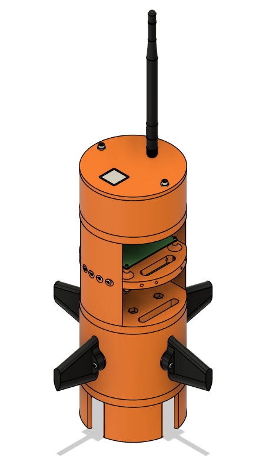
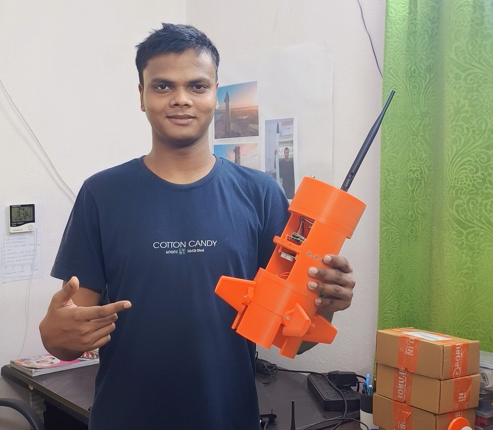

<h1 align="center">
  🚀 Welcome to Pie Space: Pioneering the Future of Aerospace 🚀
</h1>

  

  
  
  

---

## 📖 Table of Contents
- [🚀 Our Mission](#-our-mission)
- [🛰️ Current Projects](#️-current-projects)
- [🌱 Research & Development](#-research--development)
- [🌐 Connect with Us](#-connect-with-us)
- [🛠️ Our Technologies](#️-our-technologies)
- [📊 Metrics](#-metrics)
- [🎇 SkyVoyager CanSat](#-skyvoyager-cansat)
- [📫 Get in Touch](#-get-in-touch)

---

## 🚀 Our Mission
<h2 align="center">
  
</h2>

  

---

## 🛰️ Current Projects
- **🚀 VTVL Rocket Development**: 
  - **Goal**: Engineering a vertical take-off and vertical landing (VTVL) rocket with interplanetary ambitions.
  - **Status**: In advanced prototype testing phase.
  - 

- **🤖 Robotics**:
  - **Focus**: Designing autonomous robots integrated with AI and IoT, enhancing smart systems for space exploration.
  - **Research Areas**: Swarm intelligence, machine learning, and adaptive control systems.
  - 

- **💻 Software Engineering**:
  - **Goal**: Crafting state-of-the-art software for real-time data processing and rocket control simulations.
  - **Tools**: Python (PyQt, Customtkinter), C++ with Qt for GUI applications, and real-time telemetry.
  - **Current Focus**: Building a super-advanced Ground Control System GUI for our VTVL rocket.
  - 

  

---

## 🌱 Research & Development
- **Continuous Learning**: Our team is dedicated to advancing in aerospace, AI, and robotics by exploring cutting-edge technologies.
  - 
  - Areas of interest: Quantum computing, neural networks, AI-driven control systems.
  
- **Collaborations**: Actively seeking partnerships and collaborations to innovate together.
  - 
  - Open to joint ventures in aerospace, robotics, and AI innovation.

---

## 🌐 Connect with Us

  
  
  
  

---

## 🛠️ Our Technologies

  
  
  
  
  
  
  
  
  
  
  

---

## 📊 Metrics

  
  
  

---

## 🎇 SkyVoyager CanSat

  

> **SkyVoyager CanSat**: A CanSat project designed for atmospheric data collection and telemetry simulations, preparing the way for future space exploration technologies.

---

## 📫 Get in Touch

  
  

  

<h2 align="center">
  🚀 Embark on a Journey Beyond the Stars with Pie Space! 🚀
</h2>

---

*Feel free to reach out for collaborations, project discussions, or just to chat about the future of space travel!*
